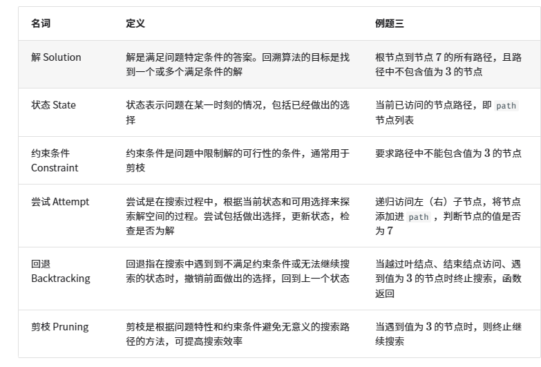

#回溯算法
    通过穷举来解决问题的方法，它的核心思想是从一个初始状态出发，暴力搜索所有可能的解决方案，当遇到正确的解则将其记录，直到找到解或者尝试了所有可能的选择都无法找到解为止。

**回溯法解决的问题都可以抽象为树形结构，是的，我指的是所有回溯法的问题都可以抽象为树形结构！**

常用**深度优先搜素**来遍历空间

  ***
例题：在二叉树中搜索并返回所有值为7的节点
```C++
/* 前序遍历 */
void preOrder(TreeNode *root) {
    if (root == nullptr) {
        return;
    }
    if (root->val == 7) {
        // 记录解
        res.push_back(root);
    }
    preOrder(root->left);
    preOrder(root->right);
}

```
  ***

##尝试与回退
之所以称之为回溯算法，是因为该算法在搜索解空间时会采用“尝试”与“回退”的策略。当算法在搜索过程中遇到某个状态无法继续前进或无法得到满足条件的解时，它会撤销上一步的选择，退回到之前的状态，并尝试其他可能的选择。

对于例题一，访问每个节点都代表一次“尝试”，而越过叶结点或返回父节点的 return 则表示“回退”。

值得说明的是，回退并不等价于函数返回。

***
例题2  在例题1的基础上  返回根节点到目标节点的路径
``` C++
void preOrder(TreeNode* root)
{
    if (!root)  return nullptr;

    path.push_back(root);
    if (root->val == 7)
        res.push_back(path);

    preOrder(root->left);
    preOrder(root->right);
    path.pop_back();
}
```
***

##剪枝
复杂的回溯问题通常包含一个或多个约束条件，约束条件通常可用于“剪枝”。

***
例题3： 例题2的基础上  路径中不能包含有3节点

``` C++
void preOrder(TreeNode* root)
{
    if (!root || root->val == 3)
        return;
    
    path.push_back(root);
    if (root->val == 7)
        ans.push_back(path);

    preOrder(root->left);
    preOrder(root->right);
    path.pop_back();
}
```
***
剪枝是一个非常形象的名词。在搜索过程中，我们利用约束条件“剪掉”了不满足约束条件的搜索分支，避免许多无意义的尝试，从而提升搜索效率。

##常用术语



    解、状态、约束条件等术语是通用的，适用于回溯算法、动态规划、贪心算法等。


## 代码框架
``` C++
// 例题3

//判断当前状态是否是解
bool isSolution(vector<TreeNode*>& state)
{
    return !state.empty() && state.back()->val == 7;
}

// 记录解
void recordSolution(vector<TreeNode*>& state, vector<vector<TreeNode*>>& res)
{
    res.push_back(state);
}

// 验证解
bool isValid(vector<TreeNode*>& state, TreeNode* choice)
{
    return choice != nullptr && choice->val != 3;
}

//更新状态
void makeChoices(vector<TreeNode*>& state, TreeNode* choice)
{
    state.push_back(choice);
}

//恢复状态
void undoChoices(vector<TreeNode*>& state, TreeNode* choice)
{
    state.pop_bakc();
}

//回溯算法
void backTrack(vector<TreeNode*>& state, vector<TreeNode*>& choices, vector<vector<TreeNode*>>& res )
{
    if (isSolution(state))
    {
        recordChoice(state, res);
        return;
    }

    for (TreeNode* choice : choices)
    {
        isValid(state, choice);
        makeChoices(state,choice);

        vector<TreeNode*> newChoices{choice->left, choice->right};
        backTrack(state, newChoices, res);
        undoChoices(state, choice);
    }
}
```
所有回溯问题都可以在该框架下解决。我们只需要根据问题特点来定义框架中的各个变量，实现各个方法即可。

## 典型例题
1. **搜索问题**：这类问题的目标是找到满足特定条件的解决方案
    - 全排列问题：给定一个集合，求出其所有可能的排列组合。
    - 子集和问题：给定一个集合和一个目标和，找到集合中所有和为目标和的子集。
    - 汉诺塔问题：给定三个柱子和一系列大小不同的圆盘，要求将所有圆盘从一个柱子移动到另一个柱子，每次只能移动一个圆盘，且不能将大圆盘放在小圆盘上。
2. **约束满足问题**：这类问题的目标是找到满足所有约束条件的解。
    -  n皇后：在nxn的棋盘上放置n个皇后，使得它们互不攻击。
    -  数独：在9x9的网格中填入数字  ，使得每行、每列和每个3x3子网格中的数字不重复。
    -  图着色问题：给定一个无向图，用最少的颜色给图的每个顶点着色，使得相邻顶点颜色不同。
3. **组合优化问题**：这类问题的目标是在一个组合空间中找到满足某些条件的最优解。
    - 0-1 背包问题：给定一组物品和一个背包，每个物品有一定的价值和重量，要求在背包容量限制内，选择物品使得总价值最大。
    - 旅行商问题：在一个图中，从一个点出发，访问所有其他点恰好一次后返回起点，求最短路径。
    - 最大团问题：给定一个无向图，找到最大的完全子图，即子图中的任意两个顶点之间都有边相连。


