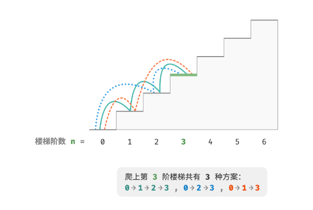
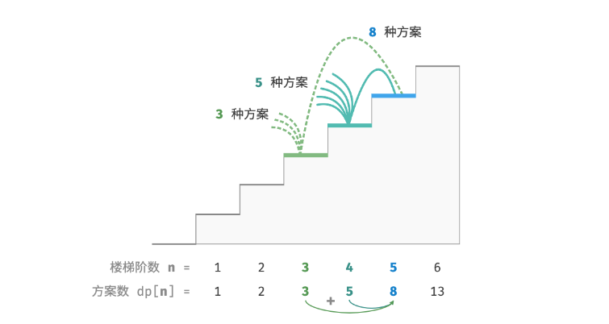
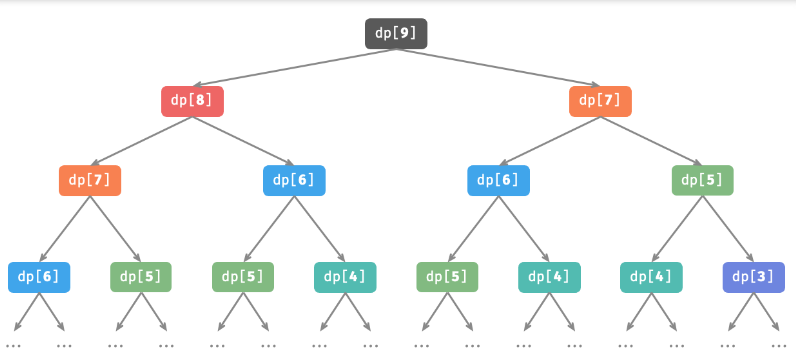
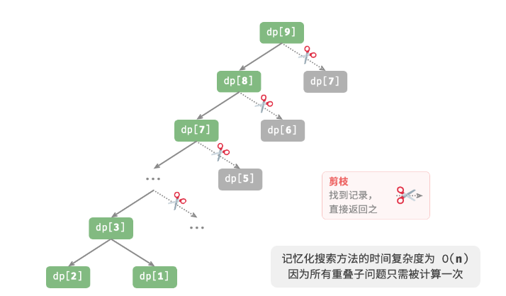
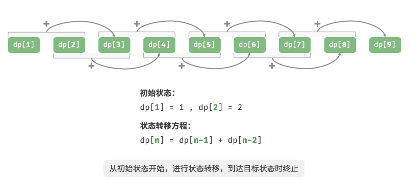
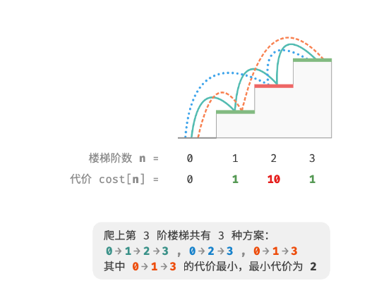
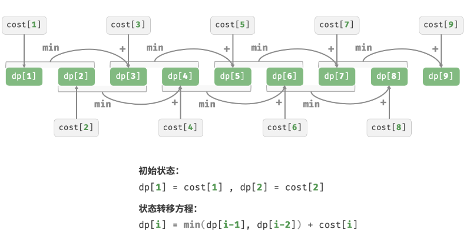

#动态规划
## 动态规划解题步骤
1.确定dp数组（dp table）以及下标的含义
2.确定递推公式
3.dp数组如何初始化
4.确定遍历顺序
5.举例推导dp数组

## 什么是动态规划
「动态规划 Dynamic Programming」是一种通过将复杂问题分解为更简单的子问题方式来求解问题的方法，通常用来求解最优方案的相关问题，例如**寻找最短路径、最大利润、最少时间**等。
然而，并非所有的最优化问题都适合用动态规划来解决。只有当问题具有**重叠子问题**和**最优子结构**时，动态规划才能发挥出其优势。

## 动态规划主要特征
1.如何使用回溯算法（穷举）来求解动态规划问题。重叠子问题是什么，以及如何解决由它带来的时间复杂度过高的问题。
2.最优子结构的定义，以及它在动态规划问题中的表现形式。
3.动态规划中的主要术语，状态压缩的含义与实现方式。

##重叠子问题
###爬楼梯
***
给定一个n阶楼梯，你每步可以上1阶或者2阶，请问有多少种方案可以爬到楼顶。
***

1.回溯
``` C++
void backTracking(vector<int> choices, int state, int n, vector<int>res)
{   
    // 正好到n阶  方法+1
    if (state == n)
        res[0]++;

    for (int choice : choices)
    {
        if (state + choice > n)
            break;
        // 选择
        backTracking(choices, state + choice, n, res);
        // 回退
    }
}


int climbingStairsBacktrack(int n)
{
    vector<int> choices{1, 2}; // 上1阶或2阶
    int state = 0; // 从0阶开始
    vector<int> res{0}; //答案

    backTracking(choices, state, n, res);

    return res[0];
}
```

2.搜索

·在分治算法中，原问题被分解为较小的子问题，通过组合子问题的解得到原问题的解。例如，归并排序将一个长数组从顶至底地划分为两个短数组，再从底至顶地将已排序的短数组进行排序。
·在动态规划中，原问题的解往往依赖于其子问题的解。这些子问题的解不仅揭示了问题的局部最优解，而且还通过特定的递推关系链接起来，共同构建出原问题的全局最优解。

在本题中，假设爬到第n阶有dp[i]种方法，那么dp[i]就是原方法，子问题包括dp[i-1] dp[i-2] dp[i-3] ··· dp[2] dp[1]

每次只能上1或2阶 所以当我们站在第n阶时 只可能从dp[i-1]或者dp[i-2]上来
所以**dp[i] = dp[i-1] + dp[i-2]**



```C++
int dfs(int i)
{
    if (i == 1 || i == 2)
        return i;
    //dp[i] = dp[i-1] + dp[i-2]
    int count = dfs(i-1) + dfs(i-2);
    return count;
}

//搜索
int climbingStairsDfs(int n)
{
    return dfs(n);
}
```

对于dp[n] 树的深度是n  时间复杂度O(n^2), 有大量的重叠子问题

3. 记忆化搜索

为了提升算法效率，我们希望所有的重叠子问题只被计算一次。具体来说，考虑借助一个数组 mem 来记录每个子问题的解。当首次计算时，我们将其记录至 mem[i] ；当再次需要计算
时，我们便可直接从 mem[i] 中获取结果，从而实现将**重叠子问题剪枝**。这种方法被称为“记忆化搜索”。

```C++
int dfs2(int i, vector<int>& mem)
{
    if (i == 1 || i == 2)
        return i;
    if (mem[i] != -1)
        return mem[i];
    int count = dfs2(i-1, mem) + dfs2(i-2, mem);
    mem[i] = count;
    return count;
}

int climbingStairDfs2(int n)
{   
    // mem记录子问题答案 避免重复计算
    vector<int> mem(n+1, -1);
    return dsf2(n, mem);
}
```
时间复杂度O(n)

4. 动态规划
记忆化搜索是一种“从顶至底”的方法：我们从原问题（根节点）开始，递归地将较大子问题分解为较小子问题，直至解已知的最小子问题（叶节点）；最终通过回溯将子问题的解逐层收集，得到原问题的解。

我们也可以直接“从底至顶”进行求解：从最小子问题开始，迭代地求解较大子问题，直至得到原问题的解。这便是动态规划。

由于没有回溯过程，动态规划可以直接基于循环实现。我们初始化一个数组 dp 来存储子问题的解，从最小子问题开始，逐步求解较大子问题。在以下代码中，**数组 dp 起到了记忆化搜索中数组 mem 相同的记录作用**。

```C++
int climbingStairDp(int n)
{
    if (n == 1 || n == 2)
        return n;

    vector<int> dp(n+1);

    for (int i = 3; i <= n; ++i)
        dp[i] = dp[i-1] + dp[i-2];
    
    return dp[n];
}
```


在动态规划中，我们通常将dp数组称为「状态列表」，将最小子问题对应的状态（即dp[1],dp[2] ）称为「初始状态」，将dp[i] = dp[i-1] + dp[i-2]称为「状态转移方程」。

```C++
//状态压缩
int climbingStairDp2(int n)
{
    if (n == 1 || n == 2)
        return n;

    int a = 1, b = 2;

    for (int i = 3; i <= n; ++i)
    {
        int tem = b;
        b = a + b;
        a = tem;
    }
    
    return b;
}
```
在许多动态规划问题中，当前状态仅与前面有限个状态有关，不必保存所有的历史状态，这时我们可以通过状态压缩的技巧，只保留必要的状态，通过“降维”来节省内存空间。

//5. 最优子结构

给定一个楼梯，你每步可以上1阶或者2阶，每一阶楼梯上都贴有一个非负整数，表示你在该台阶所需要付出的代价。给定一个非负整数数组cost，其中cost[i]表示在第i个台阶需要付出的代价，cost[0]为地面起始点。请计算最少需要付出多少代价才能到达顶部？



```C++
int minCostClimbingStairDp(vector<int>& cost)
{
    //获取台阶数
    int n = cost.size() - 1;
    if (n == 1 || n == 2)
        return cost[n];
    
    vector<int> dp(n + 1);

    for (int i = 3; i <= n; ++i)
    {
        dp[i] = min(dp[i-1], dp[i-2]) + cost[i];
    }
    
    return dp[n];
}
```
时间复杂度O(n)



进行状态压缩

```C++
int minCostClimbingStairDp2(vector<int>& cost)
{
    int n = cost.size() - 1;
    if (n == 1 || n == 2)
        return cost[n];

    int a = cost[1], b = cost[2];
    for (int i = 3; i <= n; ++i)
    {
        int tem = b;
        b = min(a, b) + cost[i];
        a = tem;
    }
    return b;
}

```