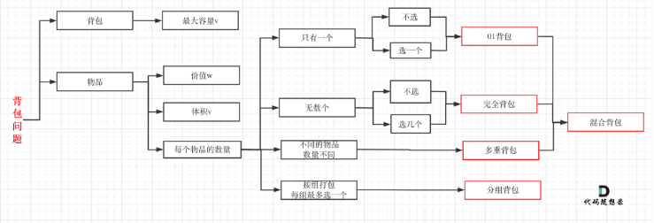
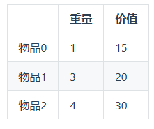
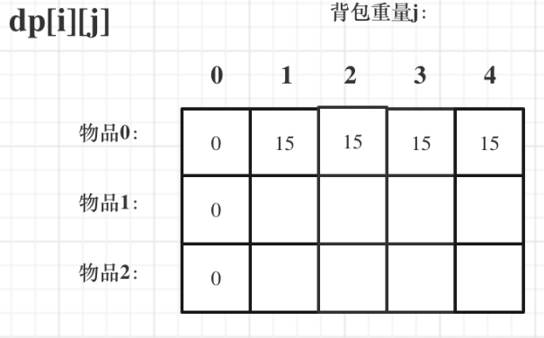

# 背包理论


## 01背包
有n件物品和一个最多能背重量为w 的背包。第i件物品的重量是weight[i]，得到的价值是value[i] 。每件物品只能用一次，求解将哪些物品装入背包里物品价值总和最大。

这是标准的背包问题，以至于很多同学看了这个自然就会想到背包，甚至都不知道暴力的解法应该怎么解了。

这样其实是没有从底向上去思考，而是习惯性想到了背包，那么暴力的解法应该是怎么样的呢？

每一件物品其实只有两个状态，取或者不取，所以可以使用回溯法搜索出所有的情况，那么时间复杂度就是$o(2^n)$，这里的n表示物品数量。

所以暴力的解法是指数级别的时间复杂度。进而才需要动态规划的解法来进行优化！

在下面的讲解中，我举一个例子：

背包最大重量为4。

物品为：
 

 5步走
1. dp[i][j]含义： 0-i号物品放入剩余容量为j的背包 得到的最大价值
2. 推导公式:
(1) dp[i-1][j]  表示i物品超重了 放不进 dp[i][j] = dp[i-1][j]
(2) dp[i-1][j-weight[i]] + values[i]

dp[i][j] = max(dp[i-1][j], dp[i-1][j-weight[i]] + values[i])
3. 初始值
   
4. 顺序
   1. 先物品后重量
   2. 先重量后物品
5. 答案

```C++
#include <iostream>
#include <vector>
using namespace std;

void test_2_wei_bag_problem()
{
    vector<int> weight{1, 3, 4};
    vector<int> value{15, 20, 30};
    int bagsize = 4;

    vector<vector<int>> dp(weight.size(), vector<int>(bagsize+1, 0));
    // 初始化
    for (int i = weight[0]; i <= bagsize; ++i)
        dp[0][i] = value[0];
        
    for (int i = 1; i < weight.size(); ++i)
        for (int j = 1; j <= bagsize; ++j)
            if (weight[i] > j)
                dp[i][j] = dp[i-1][j];
            else
                dp[i][j] = max(dp[i-1][j], dp[i-1][j-weight[i]]+value[i]);

    
    cout << dp[weight.size()-1][bagsize];
}

int main()
{
    test_2_wei_bag_problem1();
    return 0;
}
```

## 滚动数组

```C++
void test_1_wei_bag_problem()
{
    vector<int> weight{1, 3, 4};
    vector<int> value{15, 20, 30};
    int bagsize = 4;
    
    vector<int> dp(bagsize+1, 0);
    for (int i = 0; i < weight.size(); ++i)
        for (int j = bagsize; j >= weight[i]; --j)
            dp[j] = max(dp[j], dp[j-weight[i]]+value[i]);
    
    cout << dp[bagsize];
}
```


