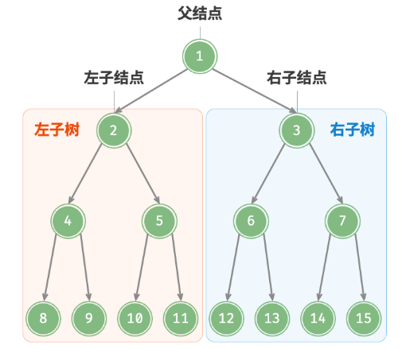
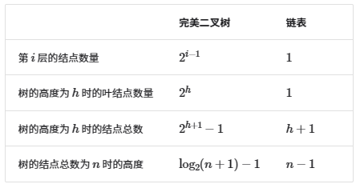
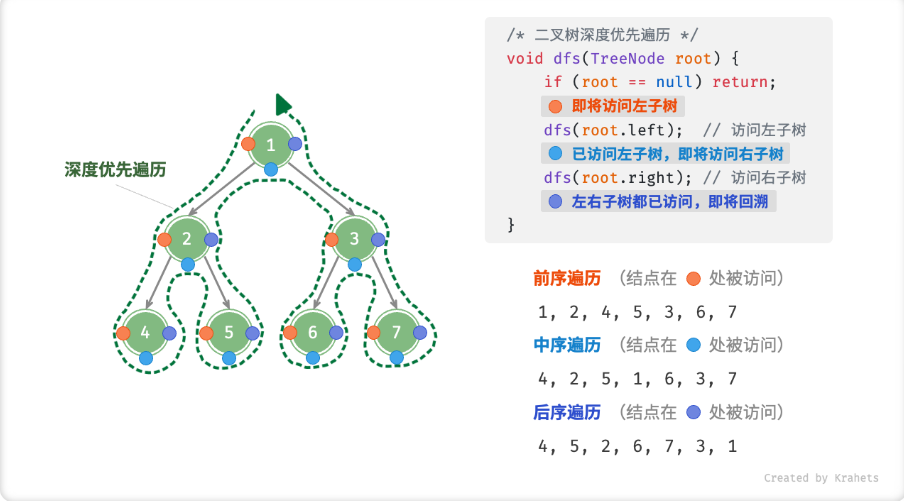
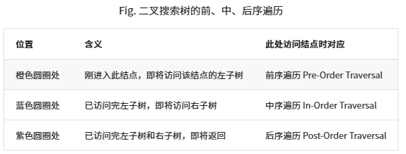
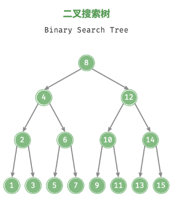
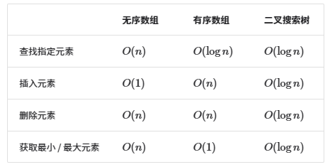
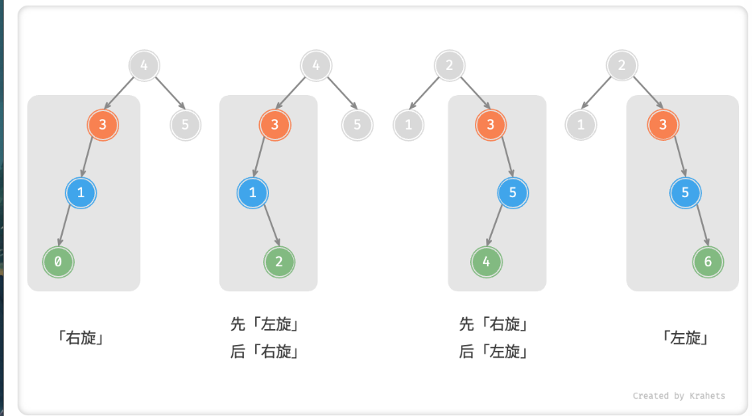
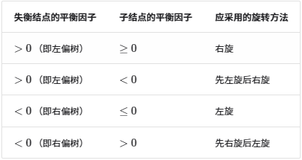

#二叉树
   「二叉树 Binary Tree」是一种非线性数据结构，代表着祖先与后代之间的派生关系，体现着“一分为二”的分治逻辑。类似于链表，二叉树也是以结点为单位存储的，结点包含「值」和两个「指针」。 

``` C++
/*二叉树结构体定义*/
class TreeNode
{   
public:
    TreeNode(int x) : val(x), left(nullptr), right(nullptr) {}
    int val;
    TreeNode *left;
    TreeNode *right;
};
```

结点的两个指针分别指向「左子结点 Left Child Node」和「右子结点 Right Child Node」，并且称该结点为两个子结点的「父结点 Parent Node」。给定二叉树某结点，将左子结点以下的树称为该结点的「左子树 Left Subtree」，右子树同理。

除了叶结点外，每个结点都有子结点和子树。例如，若将下图的「结点 2」看作父结点，那么其左子结点和右子结点分别为「结点 4」和「结点 5」，左子树和右子树分别为「结点 4 及其以下结点形成的树」和「结点 5 及其以下结点形成的树」。

## 二叉树常见术语


## 二叉树基本操作

``` C++
/*初始化节点*/
    TreeNode *n1 = new TreeNode(1);
    TreeNode *n2 = new TreeNode(2);
    TreeNode *n3 = new TreeNode(3);
    TreeNode *n4 = new TreeNode(4);
    TreeNode *n5 = new TreeNode(5);
    
    n1->left = n2;
    n1->right = n3;
    n2->left = n4;
    n2->right = n5;


    /*节点插入与删除*/
    // 与链表类似， 通过修改指针实现

    TreeNode *p = new TreeNode(0);
    // 增加p
    n1->left = p;
    p->left = n2;
    // 删除p
    n1->left = n2;
    delete p;
```

## 常见二叉树类型

- 完美二叉树(满二叉树)：所有节点被填满
- 完全二叉树：只有最底层没填满，且靠左开始填
- 完满二叉树：除了叶子节点，其他节点有两个子节点
- 平衡二叉树：任意节点的左右树高度差<=1
  
## 二叉树的退化
- 完美二叉树完全发挥出了二叉树“分治”的优势
- 链表是一个极端，变为线性，各项操作O(n)



## 数组储存二叉树
节点索引:i
左子节点索引:2i + 1
右子节点索引:2i + 2

按照完美二叉树的形式在储存所有二叉树， 用特殊符号来表示空位


# 二叉树遍历
二叉树也是通过指针遍历节点， 树还是一种非线性数据结构， 遍历起来更加复杂

常见算法: 层序遍历、 前序遍历、 中序遍历、 后序遍历

## 层序遍历
自顶向下 一层层遍历 每层从左向右

    本质是 广度优先搜索

``` C++
vector<int> levelOrder(TreeNode *root)
{
    queue<TreeNode*> que;
    que.push(root);

    vector<int> ans;

    while (!que.empty())
    {   
        TreeNode *node = que.front();
        ans.push_back(node->val);
        que.pop();

        if (node->left != nullptr)
            que.push(node->left);
        if (node->right != nullptr)
            que.push(node->right);
    }
    
    return ans;
}

```
    时间复杂度O(n)
    空间复杂度O(n)

## 前序、中序、后续排列
    这三种遍历方式  **深度优先遍历**， 体现先走到头 在回头继续

    下面这张图真的 太牛了





``` C++
/*前序遍历*/
void preOrder(TreeNode *root, vector<int> &vec)
{
    if (root == nullptr) return;
    vec.push_back(root->val);
    preOrder(root->left, vec);
    preOrder(root->right, vec);

}

/*中序遍历*/
void midOrder(TreeNode *root, vector<int> &vec)
{
    if (root == nullptr) return;
    midOrder(root->left, vec);
    vec.push_back(root->val);
    midOrder(root->right, vec);
}

/*后序遍历*/
void postOrder(TreeNode *root, vector<int> vec)
{
    if (root == nullptr) return;
    postOrder(root->left, vec);
    postOrder(root->right, vec);
    vec.push_back(root->val);
}
```
时间复杂度O(n)

# 二叉搜索树

1. 对于根节点， 左子树中所有节点的值<根节点值<右子树中所有节点的值
2. 任意节点的左子树和右子树也是二叉搜索树，即满足条件1



## 二叉搜索树的操作

1. 查找节点


    给定目标值， 声明一个cur节点， 从root出发
- cur->val > num 说明该找左数 cur = cur->left;
- cur->val < num 说明该找右数 cur = cur->right;
- cur->val == num 找到目标值 返回

    二叉搜索与二分查找一样， 每轮排除一半， 循环次数最多为二叉树的高度， 时间复杂度O(logn)

``` C++
/*二叉搜索树查找节点*/
TreeNode* search(TreeNode *root, int num)
{
    TreeNode *cur = root;
    while (cur != nullptr)
    {
        if (cur->val > num)
            cur = cur->left;
        else if (cur->val < num)
            cur = cur->right;
        else
            break; 
    }
    return cur;
}
```

## 二叉搜索树插入元素
1. 先找到应该插入的位置
2. 插入
    因为左子树<节点<右子树， 所以 不存在相等的值 遇到相等直接返回

```C++
TreeNode *insert(TreeNode *root, int num)
{
    if (root == nullptr) return nullptr;
    TreeNode *cur = root;
    TreeNode *pre = nullptr;

    while (cur != nullptr)
    {
        if (cur->val == num) return nullptr;
        pre = cur;
        if (cur->val < num)
            cur = cur->right;
        else
            cur = cur->left; 
    }

    TreeNode *node = new TreeNode(num);
    if (pre->val < num)
        pre->right = node;
    else
        pre->left = node;
    
    return node;
}

```

## 删除节点
有三种可能性
1. 待删除节点没有子节点  直接删除即可
2. 待删除结点有一个子节点， pre指向子节点即可
3.  待删除节点有两个子节点， 中序遍历待删除节点右树， 将第一个节点替换待删除节点即可

```C++
/*删除节点*/

TreeNode *getInOrderNext(TreeNode *root)
{
    if (root == nullptr) return nullptr;

    while (root->left != nullptr)
        root = root->left;
    return root;
}

TreeNode *remove(TreeNode *root, int num)
{   
    // 空树 返回null
    if (root == nullptr) return nullptr;
    
    TreeNode *cur = root;
    TreeNode *pre = nullptr;
    // 循环查找 该被删除的节点
    while (cur != nullptr)
    {
        if (cur->val == num)
            break;
        pre = cur;
        if (cur->val < num)
            cur = cur->right;
        else
            cur = cur->left;
    }
    
    // 没找到
    if (cur == nullptr) return nullptr;
    // 子节点数为0 / 1
    if (cur->left == nullptr || cur->right == nullptr)
    {
        TreeNode *child = (cur->left != nullptr) ? cur->left : cur->right;
        if (pre->left = cur)
            pre->left = child;
        else
            pre->right = child;
        delete cur;
    }
    else
    {
        TreeNode *nex = getInOrderNext(cur->right);
        int tem = nex->val;
        remove(root, nex->val);
        cur->val = tem;
    }

    return cur;
}
```

    右上可知， 在搜索二叉树中 中序遍历就是升序排列

## 二叉搜索数的效率



## 搜索二叉树应该是平衡的

否则可能变为链表  各项复杂度会退化

## 二叉搜索数的应用
- 系统中的多级索引，高效查找、插入、删除操作。
- 各种搜索算法的底层数据结构。
- 存储数据流，保持其已排序。


# AVL树(平衡二叉搜索树)
    频繁增删查改的使用场景中，AVL 树可始终保持很高的数据增删查改效率，具有很好的应用价值(不退化)

``` C++
/*AVL树定义*/
struct AVL
{
    int val;
    int height = 0; // 节点高度
    AVL *left;
    AVL *right;
    AVL() = default;
    AVL(int num) : val(num), left(nullptr), right(nullptr) {}
};
```
    节点高度是最远叶节点到该节点的距离， 即走过的边数量， **叶节点的高度为0** **空节点的高度为-1**

``` C++
/*获取节点高度*/
int height(AVL *root)
{
    return root == nullptr ? -1 : root->height;
}

/*更新结点高度*/
void updateHeight(AVL *root)
{   
    //最高子树高度+1
    root->height = max(height(root->left), height(root->right)) + 1;
}

/*获取平衡因子*/
// 节点左树高度-节点右树高度
int balanceFactor(AVL *root)
{
    if (root == nullptr) return 0;

    return height(root->left) - height(root->right);
}
```
    任意一颗AVL树的平衡因子的绝对值<= 1(平衡二叉树)

## AVL树旋转
    在不影响树为搜索二叉树前提下 保证树为平衡二叉树

    失衡节点：平衡因子绝对值>1的节点
    旋转操作：右旋、左旋、先右旋后左旋、先左旋后右旋

1. 右旋
``` C++
/*AVL树右旋*/
AVL *rightRotate(AVL *root)
{
    AVL *child = root->left;
    AVL *grandChild = child->right;

    child->right = root;
    root->left = grandChild;

    updateHeight(grandChild);
    updateHeight(child);
    updateHeight(root);

    return child;
}
```
2. 左旋
```C++
/*AVL树左旋*/
AVL *leftRotate(AVL *root)
{
    AVL *child = root->right;
    AVL *grandChild = child->left;

    child->left = root;
    root->right = grandChild;

    updateHeight(root);
    updateHeight(child);

    return child;
}
```

    「左旋」和「右旋」操作是镜像对称的，两者对应解决的两种失衡情况也是对称的。根据对称性，我们可以很方便地从「右旋」推导出「左旋」。具体地，只需将「右旋」代码中的把所有的 left 替换为 right 、所有的 right 替换为 left ，即可得到「左旋」代码。

3. 先左旋后右旋


4. 先右旋在左旋

## 旋转的选择




```C++
/*执行旋转 恢复平衡*/
AVL *rotata(AVL *node)
{   
    // 获取节点node的平衡因子
    int _balanceFactor = balanceFactor(node);
    // 左偏树
    if (_balanceFactor > 1)
    {
        // 右旋
        if (balanceFactor(node->left) >= 0)
            return rightRotate(node);
        else
            node->left = rightRotate(node->left);
            return leftRotate(node);  
    }
    
    if (_balanceFactor < -1)
    {
        if (balanceFactor(node->right) <= 0)
        {
            return leftRotate(node);
        }
        else
            node->right = leftRotate(node->right);
            return leftRotate(node);
    }

    // 平衡 无需选择
    return node;
}
```