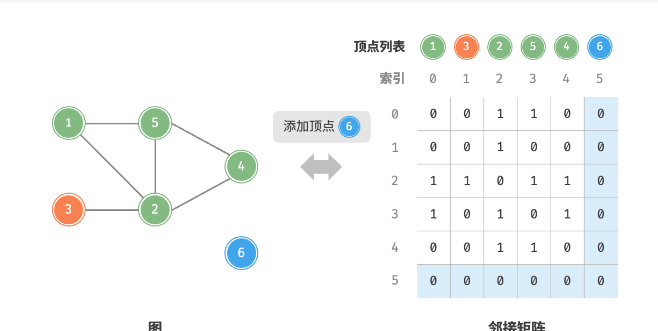

# 图
「图 graph」是一种非线性数据结构，由「顶点 vertex」和「边 edge」组成。我们可以将图抽象地表示为一组顶点和一组边 的集合。


## 图常见类型与术语
1. 有向图：边具有方向性，即 和 两个方向的边是相互独立的，例如微博或抖音上的“关注”与“被关注”关系。
2. 无向图：边表示两顶点之间的“双向”连接关系，例如微信或 QQ 中的“好友关系


1. 连通图
2. 非连通图


1. 有权图
2. 无权图


术语：
1. 「邻接 adjacency」：当两顶点之间存在边相连时，称这两顶点“邻接”
2. 「邻接 adjacency」：当两顶点之间存在边相连时，称这两顶点“邻接”
3. 「度 degree」：一个顶点拥有的边数。对于有向图，「入度 In-Degree」表示有多少条边指向该顶点，「出度 Out-Degree」表示有多少条边从该顶点指出。


## 图的表示
图的常用表示方式包括“邻接矩阵”和“邻接表”

1. 邻接矩阵
设图的顶点数量为n ，「邻接矩阵 adjacency matrix」使用一个n*n大小的矩阵来表示图，每一行（列）代表一个顶点，矩阵元素代表边，用 或 表示两个顶点之间是否存在边。

- 顶点不能与自身相连，因此邻接矩阵主对角线元素没有意义。
- 对于无向图，两个方向的边等价，此时邻接矩阵关于主对角线对称。
- 将邻接矩阵的元素从1和0替换为权重，则可表示有权图。

2. 邻接表
「邻接表 adjacency list」使用n个链表来表示图，链表节点表示顶点。第i条链表对应顶点i，其中存储了该顶点的所有邻接顶点（即与该顶点相连的顶点）

邻接表仅存储实际存在的边，而边的总数通常远小于n^2，因此它更加节省空间。然而，在邻接表中需要通过遍历链表来查找边，因此其时间效率不如邻接矩阵。

邻接表结构与哈希表中的“链式地址”非常相似，因此我们也可以采用类似方法来优化效率。比如当链表较时，可以将链表转化为 AVL 树或红黑树，
还可以把链表转换为哈希表，从而将时间复杂度降低至O(1)。

##图应用


# 图基础操作
图的基础操作可分为对“边”的操作和对“顶点”的操作。在“邻接矩阵”和“邻接表”两种表示方法下，实现方式有所不同。

给定一个顶点数量为 n 的无向图，则各种操作的实现方式如图所示。

- 添加或删除边：直接在邻接矩阵中修改指定的边即可，使用 \(O(1)\) 时间。而由于是无向图，因此需要同时更新两个方向的边。
- 添加顶点：在邻接矩阵的尾部添加一行一列，并全部填 \(0\) 即可，使用 \(O(n)\) 时间。
- 删除顶点：在邻接矩阵中删除一行一列。当删除首行首列时达到最差情况，需要将 \((n-1)^2\) 个元素“向左上移动”，从而使用 \(O(n^2)\) 时间。
- 初始化：传入 \(n\) 个顶点，初始化长度为 \(n\) 的顶点列表 vertices ，使用 \(O(n)\) 时间；初始化 \(n \times n\) 大小的邻接矩阵 adjMat ，使用 \(O(n^2)\) 时间。





``` C++
class GraphAdjMat
{
public:
    GraphAdjMat(const vector<int>& ver, const vector<vector<int>>& edges) : vertices(ver), adjMat(edges) {}
    

    /*获取顶点个数 */
    int size() const
    {
        return vertices.size();
    }

    /*添加顶点*/
    void addVertex(int val)
    {
        int n = size();
        vertices.push_back(val);
        adjMat.emplace_back(vector<int>(n, 0));
        for (auto& row : adjMat)
            row.push_back(0);
    }

    //删除顶点
    void removeVertex(int index)
    {
        if (index >=size())
            throw out_of_range("顶点不存在");
        // 删除顶点列表中index的元素
        vertices.erase(vertices.begin()+index);
        // 删除领接矩阵 顶点的连线
        // 先删除行
        adjMat.erase(adjMat.begin()+index);
        //删除列
        for (auto& row : adjMat)
            row.erase(row.begin()+index);        
    }

    // 添加边
    void addEdge(int i, int j)  
    {
        if (i < 0 || j < 0 || i > size() || j > size() || i == j)
            throw out_of_range("顶点不存在");
        adjMat[i][j] = 1;
        adjMat[j][i] = 1;
    }

    // 删除边
    void removeEdge(int i, int j)   
    {
        if (i < 0 || j < 0 || i > size() || j > size() || i == j)
            throw out_of_range("顶点不存在");
        adjMat[i][j] = 0;
        adjMat[j][i] = 0;
    }

    //打印领接矩阵
    void print()
    {
        cout << "顶点列表:" << endl;
        printVector(vertices);
        cout << "领接矩阵:" << endl;
        printVectorMatrix(adjMat); 
    }
private:
    vector<int> vertices; // 顶点列表， 元素代表顶点， 索引代表顶点索引
    vector<vector<int>> adjMat; // 领接矩阵 行列索引代表顶点索引   
};
```


## 基于邻接表
设无向图的顶点总数为 \(n\)、边总数为 \(m\) ，则可根据图所示的方法实现各种操作。

添加边：在顶点对应链表的末尾添加边即可，使用 \(O(1)\) 时间。因为是无向图，所以需要同时添加两个方向的边。

删除边：在顶点对应链表中查找并删除指定边，使用 \(O(m)\) 时间。在无向图中，需要同时删除两个方向的边。

添加顶点：在邻接表中添加一个链表，并将新增顶点作为链表头节点，使用 \(O(1)\) 时间。
删除顶点：需遍历整个邻接表，删除包含指定顶点的所有边，使用 \(O(n + m)\) 时间。

初始化：在邻接表中创建 \(n\) 个顶点和 \(2m\) 条边，使用 \(O(n + m)\) 时间。


``` C++
class GraphAdjList
{
public:
    GraphAdjList(const vector<vector<Vertex *>> &edges) {
        // 添加所有顶点和边
        for (const vector<Vertex *> &edge : edges) {
            addVertex(edge[0]);
            addVertex(edge[1]);
            addEdge(edge[0], edge[1]);
        }
    }

    void remove(vector<VerTex*>& vec, VerTex* vet)
    {
        for (int i = 0; i < vec.size(); ++i)
            if (vec[i] == vet)
            {
                vec.erase(vec.begin()+i);
                break;
            }
    }

    // 获取顶点数量
    int size()
    {
        return adjList.size();
    }

    //添加边
    void addEdge(VerTex* vet1, VerTex* vet2)
    {
        if (!adjList.count(vet1) || !adjList.count(vet2) || vet1 == vet2)
            throw out_of_range("不存在顶点");
        adjList[vet1].push_back(vet2);
        adjList[vet2].push_back(vet1);
    }

    //删除边
    void removeEdge(VerTex* vet1, VerTex* vet2)
    {
        if (!adjList.count(vet1) || !adjList.count(vet2) || vet1 == vet2)
            throw out_of_range("不存在顶点");
        remove(adjList[vet1], vet2);
        remove(adjList[vet2], vet1);
    }
    
    // 添加顶点
    void addVertex(VerTex* vet)
    {
        if (adjList.count(vet))
            return;
        adjList[vet] = vector<VerTex*>();
    }

    // 删除节点
    void removeVertex(VerTex* vet)
    {
        if (!adjList.count(vet))
            throw invalid_argument("不存在顶顶啊");
        adjList.erase(vet);
        for (auto& adj : adjList)
            remove(adj.second, vet);
    }

    // 打印列表
    void print()
    {
        cout << "邻接表:" << endl;
        for (auto& adj : adjList)
        {
            const auto& key = adj.first;
            const auto& vec = adj.second;
            cout << key->val << ":";
            printVector(vetToVals(vec));
        }
    }
private:
    unordered_map<VerTex*, vector<VerTex*>> adjList;
};

```

## 效率对比

似乎邻接表（哈希表）的时间与空间效率最优。但实际上，在邻接矩阵中操作边的效率更高，只需要一次数组访问或赋值操作即可。综合来看，邻接矩阵体现了“以空间换时间”的原则，而邻接表体现了“以时间换空间”的原则。


# 图的遍历
树代表的是“一对多”的关系，而图则具有更高的自由度，可以表示任意的“多对多”关系。因此，我们可以把树看作是图的一种特例。显然，树的遍历操作也是图的遍历操作的一种特例。
图的遍历方式可分为两种：「广度优先遍历 breadth-first traversal」和「深度优先遍历 depth-first traversal」。它们也常被称为「广度优先搜索 breadth-first search」和「深度优先搜索 depth-first search」，简称 BFS 和 DFS 。

## 广度优先遍历
广度优先遍历是一种由近及远的遍历方式，从某个节点出发，始终优先访问距离最近的顶点，并一层层向外扩张。如图 9-9 所示，从左上角顶点出发，先遍历该顶点的所有邻接顶点，然后遍历下一个顶点的所有邻接顶点，以此类推，直至所有顶点访问完毕。


```C++
vector<VerTex*> graphBFS(GraphAdjList& graph, VerTex* startVet)
{
    vector<VerTex*> res;  //遍历序列
    unordered_set<VerTex*> visited{startVet};
    queue<VerTex*> que;
    que.push(startVet);

    while (!que.empty())
    {
        VerTex* vet = que.front();
        que.pop();
        res.push_back(vet);

        for (auto adjVet : graph.adjList[vet])
        {
            if (visited.count(adjVet))
                continue;
            que.push(adjVet);
            visited.emplace(adjVet);
        }    
    }

    return res;
}
```

广度优先遍历的序列是否唯一？
不唯一。广度优先遍历只要求按“由近及远”的顺序遍历，而多个相同距离的顶点的遍历顺序是允许被任意打乱的。以图 9-10 为例，顶点 \(1\)、\(3\) 的访问顺序可以交换、顶点 \(2\)、\(4\)、\(6\) 的访问顺序也可以任意交换。


时间复杂度： 所有顶点都会入队并出队一次，使用 \(O(|V|)\) 时间；在遍历邻接顶点的过程中，由于是无向图，因此所有边都会被访问 \(2\) 次，使用 \(O(2|E|)\) 时间；总体使用 \(O(|V| + |E|)\) 时间。

空间复杂度： 列表 res ，哈希表 visited ，队列 que 中的顶点数量最多为 \(|V|\) ，使用 \(O(|V|)\) 空间。


## 深度优先遍历

深度优先遍历是一种优先走到底、无路可走再回头的遍历方式。如图所示，从左上角顶点出发，访问当前顶点的某个邻接顶点，直到走到尽头时返回，再继续走到尽头并返回，以此类推，直至所有顶点遍历完成。


这种“走到尽头再返回”的算法范式通常基于递归来实现。与广度优先遍历类似，在深度优先遍历中我们也需要借助一个哈希表 visited 来记录已被访问的顶点，以避免重复访问顶点。

``` C++
// 深度优先遍历
void dfs(GraphAdjList& graph, unordered_set<VerTex*>& visited, vector<VerTex*>& res, VerTex* startVet)
{
    res.push_back(startVet);
    visited.emplace(startVet);

    for (auto adjVet : graph.adjList[startVet])
    {
        if (visited.count(adjVet))
            continue;
        dfs(graph, visited, res, adjVet);
    }
}

vector<VerTex*> graphDFS(GraphAdjList& graph, VerTex* startVet)
{
    vector<VerTex*> res;
    unordered_set<VerTex*> visited;
    dfs(graph, visited, res, startVet);
    return res;
}
```

时间复杂度： 所有顶点都会被访问 \(1\) 次，使用 \(O(|V|)\) 时间；所有边都会被访问 \(2\) 次，使用 \(O(2|E|)\) 时间；总体使用 \(O(|V| + |E|)\) 时间。

空间复杂度： 列表 res ，哈希表 visited 顶点数量最多为 \(|V|\) ，递归深度最大为 \(|V|\) ，因此使用 \(O(|V|)\) 空间。