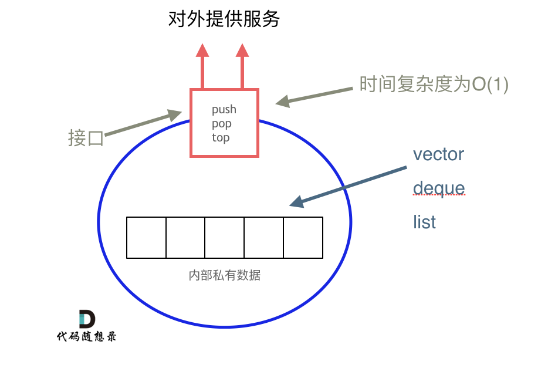

#栈
##C++中栈是容器吗
    STL中的栈不被归类于容器，栈以底层容器完成工作，对外提供统一接口，底层容器可插拔（可以选择用的容器）
    STL的栈被归类为container adapter

    队列也不是容器，是container adapter

##我们使用的栈是哪个版本STL
SGI STL

##我们使用的STL中的栈是如何实现的



    栈的底层实现可以是vector deque list
  
    SGI STL默认是deque为**缺省**下的栈底层结构

    SGI 队列一样以deque实现
以vector为栈底层实现
```
std::stack<int, std::vector<int>> third;
```
    同上述 队列是先进先出结构，同样不允许遍历行为，不提供迭代器，SGI STL的队列仍以deque为底层
以list为底层实现
```
std::queue<int, std::list<int>> aa;
```

##栈提供迭代器来遍历吗
栈提供pop push top等等接口， 但是所有元素应该遵守先进后出规则，所以不提供走访功能以及迭代器

##两种实现栈的方法对比
###支持操作
都支持栈所需要的各项操作
###时间效率
1.数组都在事先分配好的空间进行，效率很高，但是如果超过预先设定容量，要进行扩容，那么本次的时间复杂度为O(n)
2.链表实现的话，需要初始化节点，修改指针，效率不如数组，但是如果入栈元素是节点的话，可以省去初始化过程

综上所述
- 数组扩容比较慢, 但是总体效率高
- 链表可以提供更稳定效率表现
  
###空间效率
- 扩容机制可能会浪费空间
- 节点需要额外空间储存指针
- 因此要具体分析
  
###典型应用
- 浏览器的前进后退, 软件撤销反撤销
- 程序内存管理:比如函数调用 递归函数